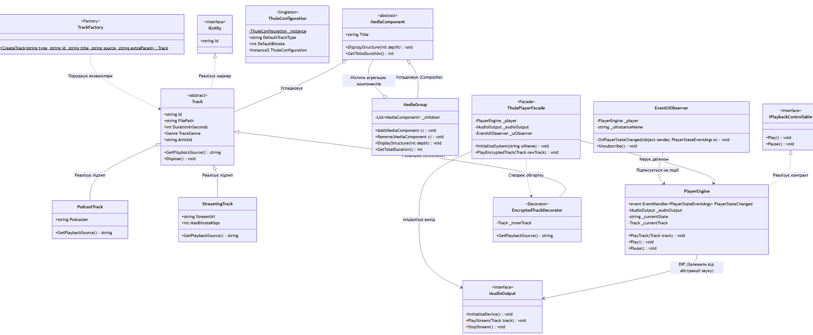

# Thule-Signal Core: Advanced Media Player Engine

Проєкт розроблено в межах курсу практичних занять та самостійних робіт з архітектури програмного забезпечення та контрактного об'єктно-орієнтованого проєктування на C#.

Система являє собою масштабований, слабозв'язаний двіжок аудіоплеєра промислового рівня, побудований за принципами **Clean Architecture** та **SOLID**.

---

## Архітектура та Структура Проєкту

Проєкт розділено на три ізольовані шари згідно з правилами Dependency Inversion:

* **`ThuleSignal.Domain`**: Сутності предметної області (`Track`, `Playlist`, `Artist`), бізнес-інваріанти, Custom Exceptions та базові інтерфейси-маркери. Не має жодних зовнішніх залежностей.
* **`ThuleSignal.App`**: Сервіси бізнес-логіки (`PlayerEngine`), впровадження патернів, DTO (Data Transfer Objects), сервіси мапінгу та серіалізації в JSON.
* **`ThuleSignal.Tests`**: Шар автоматизованого Unit-тестування критичних вузлів на базі фреймворку xUnit та ізоляції Moq.

---

##  Застосовані Патерни Проєктування (GoF & SOLID)

У процесі еволюції системи було успішно інтегровано такі патерни:

1.  **Поведінкові:**
    * `Strategy`: Динамічна зміна алгоритмів черги відтворення (`SequentialStrategy`, `ShuffleStrategy`).
    * `Observer`: Івент-орієнтована розв'язка логіки відтворення від інтерфейсу відображення на базі подій `event` та `EventHandler<T>` із захистом від витоків пам'яті.
    * `Iterator`: Кастомний безпечний обхід треків всередині агрегату плейлиста.
2.  **Породжувальні:**
    * `Factory Method`: Динамічна фабрика `TrackFactory` для створення підтипів треків на основі конфігурацій (JSON/CLI) без жорсткої прив'язки до реалізацій.
    * `Singleton`: Потокобезпечний менеджер конфігурацій `ThuleConfiguration` з лінивою ініціалізацією.
3.  **Структурні:**
    * `Composite`: Ієрархічне об'єднання треків та папок/альбомів у спільне дерево `MediaComponent` для рекурсивного керування групою сутностей.
    * `Decorator`: Динамічне розширення функціоналу безпеки треків (`EncryptedTrackDecorator`) без модифікації їхнього коду.
    * `Facade`: Спрощений уніфікований вхід `ThulePlayerFacade` до складної інфраструктури додатку.
